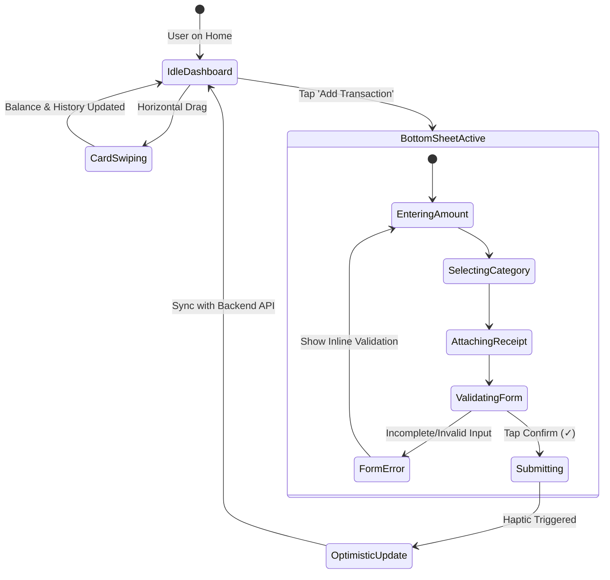

# 📱 UI/UX Planning & Architecture Specification
**Project:** Modern Dark-Mode Personal Finance & Digital Wallet Tracker App  
**Design Paradigm:** Premium Dark Mode (OLED Deep Navy/Obsidian) with Glassmorphism, Mesh Gradients, and Minimalist Micro-interactions.

---

## 1. Executive Summary & Design System Foundations

### 1.1 Color Tokens & Visual Identity
| Token Name | Hex Code | Purpose / Usage |
| :--- | :--- | :--- |
| **`bg-canvas`** | `#090A0F` | True-dark background (OLED friendly, high power efficiency) |
| **`bg-surface`** | `#12141D` | Card containers, list items, sheet background |
| **`bg-surface-elevated`** | `#1B1E2B` | Hover states, secondary action pills, active input fields |
| **`border-subtle`** | `rgba(255, 255, 255, 0.08)` | 1px border stroke on cards for depth separation |
| **`accent-primary`** | `#2F6BFF` | Electric Blue for Primary CTA, active nav, highlighted chart bar |
| **`accent-mesh-gradient`** | `linear-gradient(...)` | Indigo/Cyan/Violet mesh on top Virtual Card & dynamic header |
| **`status-positive`** | `#10B981` | Inflow transactions (`+$XX.XX`), trend growth indicators |
| **`status-negative`** | `#F43F5E` | Outflow transactions (`-$XX.XX`), expense warnings |
| **`text-primary`** | `#FFFFFF` | Main typography, card balances, headings |
| **`text-secondary`** | `#8E95A5` | Timestamps, category subtexts, inactive states |

### 1.2 Typography & Sizing Standards
* **Primary Font Family:** *Plus Jakarta Sans* or *Inter* (Clean geometric sans-serif with tabular figures).
* **Hierarchy:**
  * **Display Large (Hero Balance):** `32px` / Bold / `line-height: 40px`
  * **Heading 1 (Section Titles):** `18px` / Semi-Bold / `line-height: 24px`
  * **Body Regular:** `14px` / Regular / `line-height: 20px`
  * **Caption / Metadata:** `12px` / Medium / `line-height: 16px`

### 1.3 Micro-interactions & Haptic Patterns
* **Tactile Haptics:** Light haptic feedback on amount input tap, medium haptic on category select, strong success vibration upon transaction confirmation.
* **Dynamic Active States:** Chart bars transition to Electric Blue on active touch while non-active bars dim to 30% opacity.
* **Card Carousel Physics:** Smooth rubber-band snap pagination for switching between virtual debit/credit cards.

---

## 2. Information Architecture & Navigation Flow

```mermaid
flowchart TD
    AppStart([App Launch / Auth]) --> HomeDashboard[Home Dashboard]

    subgraph NavigationBar [Floating Island Nav Bar]
        HomeDashboard
        AnalyticsScreen[Analytics & Statistics]
        CardsScreen[Cards & Wallet Manager]
        ProfileScreen[Profile & Security Settings]
        QuickScanModal([Quick Action / Scan & Pay Button])
    end

    %% Home Interactions
    HomeDashboard -->|Tap Notification| NotifModal[Notification Center]
    HomeDashboard -->|Tap Search| GlobalSearch[Search & Filter Transactions]
    HomeDashboard -->|Tap Card Selector| CardSwitcher[Select Virtual Card]
    HomeDashboard -->|Action: Send| SendFlow[P2P Transfer Flow]
    HomeDashboard -->|Action: Add Funds/Top Up| TopUpFlow[Deposit / Payment Gateway]
    HomeDashboard -->|Action: Scan & Pay| QuickScanModal
    HomeDashboard -->|Action: Withdraw| WithdrawFlow[ATM / Bank Outflow]
    HomeDashboard -->|Tap Recent Transaction| TxDetailModal[Transaction Details & Receipt]
    HomeDashboard -->|Tap 'View All'| AllTxScreen[Full Transaction History]

    %% Analytics Interactions
    AnalyticsScreen -->|Toggle Filter| PeriodSwitch{Daily / Weekly / Monthly}
    AnalyticsScreen -->|Toggle Type| FlowSwitch{Expenses vs Income}
    AnalyticsScreen -->|Tap Bar Segment| FilteredCategoryList[Dynamic Category Breakdown]

    %% Transaction Form Flow
    HomeDashboard -->|Quick Add Button| AddTxModal[Add Transaction Bottom Sheet]
    QuickScanModal -->|Scan QR / Input Amount| AddTxModal
    AddTxModal -->|Enter Amount & Category| ConfirmAdd([Submit Transaction])
    ConfirmAdd -->|Optimistic UI Update| HomeDashboard
```



---

## 3. Detailed Screen Architecture & ASCII Wireframes

### 3.1 Screen 1: Home Dashboard (`HomeScreen.tsx`)
**Key UX Focus:** Instant clarity of total liquid balance, rapid access to 4 major wallet utilities, and a clean chronological feed of recent activities.

```text
┌────────────────────────────────────────────────────────┐
│ [9:41]                                    📶  🔋 100%  │
│                                                        │
│  (👤 Avatar) Hello Rakib / Julie Quinn    (🔔)   (🔍)   │
│                                                        │
│ ┌────────────────────────────────────────────────────┐ │
│ │ 💳 Main Card **** 6510   [▾]            (👁 Toggle)│ │
│ │                                                    │ │
│ │    Total Balance                                   │ │
│ │    $24,787.00                                      │ │
│ │    📈 +$6,258.20 (+14.4%) Last Week                │ │
│ └────────────────────────────────────────────────────┘ │
│                                                        │
│  ┌──────────┐ ┌──────────┐ ┌──────────┐ ┌──────────┐   │
│  │   ↗      │ │   +      │ │   📷     │ │   📥     │   │
│  │   Send   │ │ Add Funds│ │Scan & Pay│ │ Withdraw │   │
│  └──────────┘ └──────────┘ └──────────┘ └──────────┘   │
│                                                        │
│  Recent Transactions                         View All  │
│ ┌────────────────────────────────────────────────────┐ │
│ │ (💼) Salary Credit           Today, 10:45 AM       │ │
│ │      Inflow                    +$16.00             │ │
│ ├────────────────────────────────────────────────────┤ │
│ │ (🍕) Zomato / Starbucks      Yesterday, 8:20 PM    │ │
│ │      Food & Drinks             -$32.00             │ │
│ ├────────────────────────────────────────────────────┤ │
│ │ (⚡) Electricity Bill        Oct 28, 12:00 PM      │ │
│ │      Utility                  -$1,200.00           │ │
│ └────────────────────────────────────────────────────┘ │
│                                                        │
│       ┌───────────────────────────────────────┐        │
│       │   (🏠)    (📊)    (💳)    (👤)   [ 📷 ]│        │
│       └───────────────────────────────────────┘        │
│ ────────────────────────────────────────────────────── │
```

---

### 3.2 Screen 2: Add / Edit Transaction Sheet (`AddTransactionSheet.tsx`)
**Key UX Focus:** High-speed friction-free expense logging with thumb-accessible confirmation and instant receipt attachment.

```text
┌────────────────────────────────────────────────────────┐
│                      ═════════ (Swipe Handle)          │
│                                                        │
│ ┌────────────────────────────────────────────────────┐ │
│ │                  $10.99                            │ │
│ │             [ ✎ Change Amount ]                    │ │
│ └────────────────────────────────────────────────────┘ │
│                                                        │
│  Category                                              │
│ ┌────────────────────────────────────────────────────┐ │
│ │  📺  Subscription                               ▾  │ │
│ └────────────────────────────────────────────────────┘ │
│                                                        │
│  Date                                                  │
│ ┌────────────────────────────────────────────────────┐ │
│ │  Today (Nov 24, 2026)                           📅 │ │
│ └────────────────────────────────────────────────────┘ │
│                                                        │
│  Description / Notes                                   │
│ ┌────────────────────────────────────────────────────┐ │
│ │ Netflix monthly subscription payment               │ │
│ │                                                    │ │
│ └────────────────────────────────────────────────────┘ │
│                                                        │
│  ┌────────────┐     ┌────────────┐     ┌─────────────┐ │
│  │     ✕      │     │     📎     │     │      ✓      │ │
│  │   Cancel   │     │   Receipt  │     │   Confirm   │ │
│  └────────────┘     └────────────┘     └─────────────┘ │
│ ────────────────────────────────────────────────────── │
```

---

### 3.3 Screen 3: Analytics & Statistics Screen (`AnalyticsScreen.tsx`)
**Key UX Focus:** Clear temporal aggregation (Daily/Weekly/Monthly), interactive chart bars with floating nominal tooltips, and categorical budget impact.

```text
┌────────────────────────────────────────────────────────┐
│ [9:41]                                    📶  🔋 100%  │
│                                                        │
│  (← Back)             Statistics                 (•••) │
│                                                        │
│  ┌──────────────────────────────────────────────────┐  │
│  │ [ Daily ]      │     Weekly      │     Monthly   │  │
│  └──────────────────────────────────────────────────┘  │
│                                                        │
│                       $4,208.00                        │
│                 November • 24, Wed • 2026              │
│                                                        │
│                         [$231.87]                      │
│                            ↓                           │
│        █           █      [█]      █           █       │
│        █     █     █       █       █     █     █       │
│        █     █     █       █       █     █     █       │
│       Mon   Tue   Wed     Thu     Fri   Sat   Sun      │
│                                                        │
│  Category Breakdown                                    │
│ ┌────────────────────────────────────────────────────┐ │
│ │ (🛒) Shopping                                      │ │
│ │      Total: $4,850.00                       ↗ +18% │ │
│ ├────────────────────────────────────────────────────┤ │
│ │ (🍔) Food & Dining                                 │ │
│ │      Total: $3,200.00                       ↘ -6%  │ │
│ ├────────────────────────────────────────────────────┤ │
│ │ (💊) Health & Care                                 │ │
│ │      Total: $110.00                         – 0%   │ │
│ └────────────────────────────────────────────────────┘ │
│                                                        │
│       ┌───────────────────────────────────────┐        │
│       │   (🏠)   [(📊)]   (💳)    (👤)   [ 📷 ]│        │
│       └───────────────────────────────────────┘        │
│ ────────────────────────────────────────────────────── │
```

---

## 4. Interaction State Machine & Edge Cases



---

## 5. Implementation Roadmap & Technical Guidelines

### 5.1 Frontend Component Tree (React Native / Tailwind)
* **`AppShell`**: Dark Theme Provider + Safe Area Context
  * `TopNavigationHeader` (`Avatar`, `NotificationBadge`, `SearchInput`)
  * `MeshGradientHeroCard` (`LinearGradient`, `Animated.View`, `CardCarousel`)
  * `QuickActionGrid` (4x `PressablePill` with icon + label)
  * `TransactionSection` (`FlatList` with `TransactionItemRow`)
  * `FloatingIslandTabBar` (`BlurView`, 4 Tab items + Elevated Scan FAB)

### 5.2 Accessibility & Performance Targets
1. **WCAG AAA Contrast:** All white typography on `#12141D` background meets a minimum contrast ratio of `11.8:1`.
2. **Dynamic Island & Notch Compatibility:** Dynamic top padding via `useSafeAreaInsets()`.
3. **List Virtualization:** Utilize `FlashList` or virtualized recycler view to maintain smooth 60/120fps scrolling on long transaction histories.
